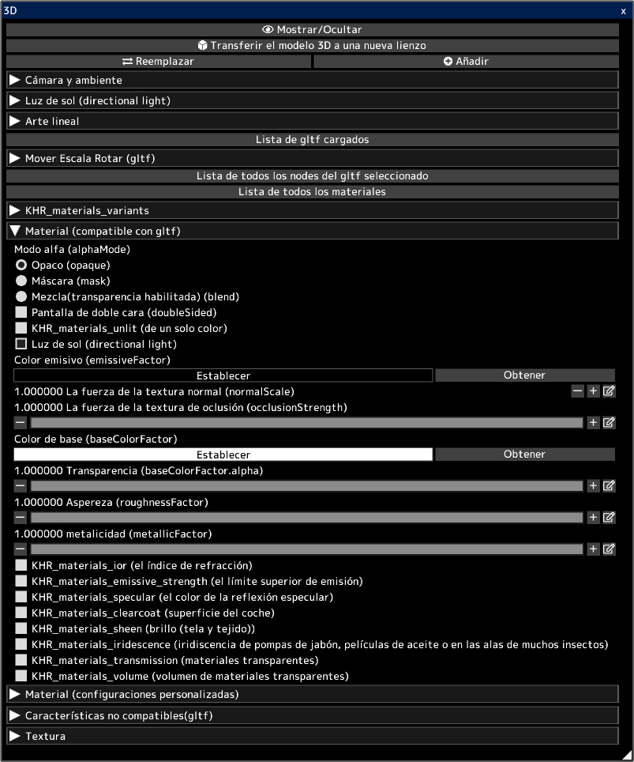

---
hide:
  - toc
---

<!-- https://steamcommunity.com/sharedfiles/filedetails/?id=2964323611 -->

Puede abrir modelos 3D en archivos gltf y glb.  
Puede transferir la apariencia de 3D al lienzo 2D tal como está.  
También puede transferir el arte lineal de 3D al lienzo 2D.  
Puede utilizar el lienzo transferido para crear su ilustración. Por ejemplo, utilícelo como fondo para una ilustración.

Los modelos 3D se pueden crear en un software 3D como [blender](https://www.blender.org/) o Autodesk Maya.  
También puede descargar modelos 3D de sitios como [sketchfab](https://sketchfab.com/).

Al hacer clic en el botón __"Reemplazar"__, se eliminarán todos los modelos 3D cargados anteriormente y se dejará solo el modelo 3D recién cargado.  
Puede agregar un modelo 3D haciendo clic en el botón __"Añadir"__.

Puede seleccionar un gltf de varios gltf cargados haciendo clic en __"Lista de gltf cargados"__.  
Puede mover/rotar/escalar el gltf seleccionado.

Puede seleccionar el nodo (objeto) en el gltf seleccionado haciendo clic en __"Lista de todos los nodes del gltf seleccionado"__.  
Puede mover/rotar/escalar el nodo seleccionado.

Puede seleccionar el material en el gltf seleccionado haciendo clic en __"Lista de todos los materiales"__.  
Puede ajustar los parámetros del material seleccionado.

La sección __"Material (compatible con gltf)"__ enumera los parámetros del material de acuerdo con la especificación gltf.  
Los modelos 3D creados con software 3D como blender se reflejan en los parámetros de este elemento "Material (compatible con gltf)".  
[Consulte este sitio para guardar gltf en blender.](https://docs.blender.org/manual/en/latest/addons/import_export/scene_gltf2.html#gltf-2-0)

Los modelos 3D descargados de sitios como [sketchfab](https://sketchfab.com/) pueden verse diferentes en sketchfab que en icpaint.  
En ese caso, habilitar KHR_materials_unlit (de un solo color) podría dar el mismo aspecto.

* La "Luz de sol (directional light)" está habilitada para todos los materiales al cargar archivos gltf o glb. Puede desmarcar la casilla de verificación "Luz de sol (directional light)" después de importar.
* No se admiten "point light" ni "spot light" (KHR_lights_punctual)
* No se admite la animación de modelos 3D.
* La iluminación por color emisivo (emissiveFactor), etc. no es compatible.
* No es compatible con la proyección de sombras para modelos 3D.
* No se admiten KHR_draco_mesh_compression, EXT_meshopt_compression, KHR_mesh_quantization.
* No se admite ktx2 (formato de imagen) (KHR_texture_basisu)

[Consulte este sitio para saber cómo editar gltf con un editor de texto.](https://github.com/KhronosGroup/glTF-Tutorials/blob/master/AddingMaterialExtensions/AddingMaterialExtensions_002_UsingVisualStudioCode.md#using-visual-studio-code)

Las descripciones oficiales de los parámetros en la sección __"Material (gltf compliant)"__ son:

* [la especificación de gltf](https://registry.khronos.org/glTF/specs/2.0/glTF-2.0.html)
* [descripción de modo alfa (alphaMode)](https://registry.khronos.org/glTF/specs/2.0/glTF-2.0.html#alpha-coverage)
* [descripción de doble cara (doubleSided)](https://registry.khronos.org/glTF/specs/2.0/glTF-2.0.html#double-sided)
* [KHR_materials_unlit (de un solo color)](https://github.com/KhronosGroup/glTF/tree/main/extensions/2.0/Khronos/KHR_materials_unlit#khr_materials_unlit)
* [descripción básica del material](https://github.com/KhronosGroup/glTF-Tutorials/blob/master/gltfTutorial/gltfTutorial_010_Materials.md#materials)
* [KHR_materials_ior (el índice de refracción)](https://github.com/KhronosGroup/glTF/tree/main/extensions/2.0/Khronos/KHR_materials_ior#khr_materials_ior)
* [KHR_materials_emissive_strength (el límite superior de emisión)](https://github.com/KhronosGroup/glTF/tree/main/extensions/2.0/Khronos/KHR_materials_emissive_strength#khr_materials_emissive_strength)
* [KHR_materials_specular (el color de la reflexión especular)](https://github.com/KhronosGroup/glTF/tree/main/extensions/2.0/Khronos/KHR_materials_specular#khr_materials_specular)
* [KHR_materials_clearcoat (superficie del coche)](https://github.com/KhronosGroup/glTF/tree/main/extensions/2.0/Khronos/KHR_materials_clearcoat#khr_materials_clearcoat)
* [KHR_materials_sheen (brillo (tela y tejido))](https://github.com/KhronosGroup/glTF/tree/main/extensions/2.0/Khronos/KHR_materials_sheen#khr_materials_sheen)
* [KHR_materials_iridescence (iridiscencia de pompas de jabón, películas de aceite o en las alas de muchos insectos)](https://github.com/KhronosGroup/glTF/tree/main/extensions/2.0/Khronos/KHR_materials_iridescence#khr_materials_iridescence)
* [KHR_materials_transmission (materiales transparentes)](https://github.com/KhronosGroup/glTF/tree/main/extensions/2.0/Khronos/KHR_materials_transmission#khr_materials_transmission-)
* [KHR_materials_volume (volumen de materiales transparentes)](https://github.com/KhronosGroup/glTF/tree/main/extensions/2.0/Khronos/KHR_materials_volume#khr_materials_volume)
