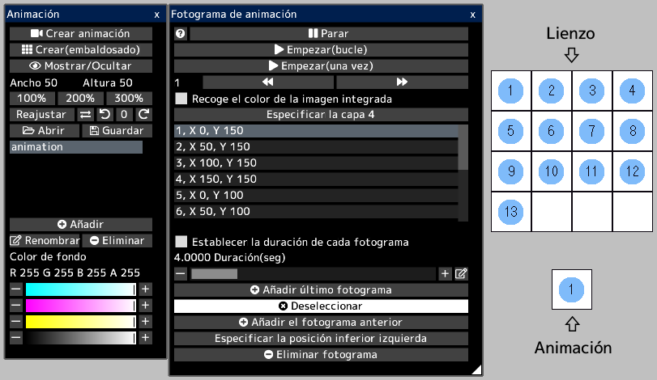
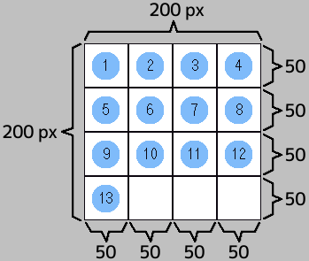

---
hide:
  - toc
---

<!-- https://steamcommunity.com/sharedfiles/filedetails/?id=2963168825 -->

La animación expresa el movimiento al cambiar continuamente las imágenes de cada fotograma.

Cada fotograma es un área (rectángulo) en el lienzo.  
Todos los fotogramas se muestran en el lienzo.

Cuando abre un archivo gif animado o webp, el lienzo se crea con la animación lista para reproducir.  
Sin embargo, si el tamaño del lienzo es demasiado grande, no se creará la animación.

Por ejemplo, en este lienzo, cada fotograma de la animación es un área cuadrada con números del 1 al 13.  
Cuando reproduzca la animación, se reproducirá de la siguiente manera.

### Cómo crear animación

Primero, crea un lienzo que se vea así.  
A continuación, abra la ventana "Animación" haciendo clic en el botón "Ventana de animación" del menú "Lienzo".

Creas 13 fotogramas.

Puede especificar la posición inferior izquierda de cada fotograma.  
__"1, X 0, Y 150"__ significa que la posición inferior izquierda del primer cuadro es (0, 150).  
La posición inferior izquierda del lienzo es (0, 0).  
En este ejemplo, cada fotograma tiene un ancho y alto de 50 px.  
Cuando se selecciona un fotograma, se muestra un marco rectangular azul en el lienzo.

Si la casilla de verificación __"Recoge el color de la imagen integrada"__ está marcada, la animación se reproducirá con la apariencia actual del lienzo.  
Si esta casilla de verificación está desactivada, la animación se reproducirá solo con la apariencia de la capa especificada.

La animación se reproducirá haciendo clic en el botón __"Empezar"__.  
Puede cambiar la posición y el tamaño de la animación que se reproduce seleccionando la herramienta de animación.

Puede guardar la animación como un archivo gif o webp.  
Dado que los archivos gif tienen una cantidad limitada de colores, puede guardarlos como un archivo gif solo cuando se selecciona la capa de pixel art.  
En este caso, debe dibujar la animación en la capa de pixel art.
