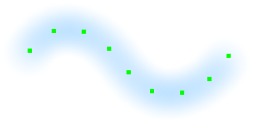
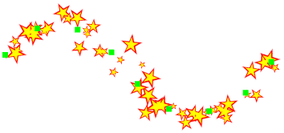

---
hide:
  - toc
---

<!-- https://steamcommunity.com/sharedfiles/filedetails/?id=2971121287 -->

La herramienta "Brocha de curva" le permite modificar sus pinceladas más adelante.  
Puede modificar su trazo de brocha haciendo clic y moviendo los puntos de control.  
También puede modificar los parámetros del pincel.

Al mover el punto de control hacia la izquierda o hacia la derecha con Shift + clic, puede cambiar la presión del lápiz en la posición del punto de control.

|  | Cómo utilizar |
| ------ | ----------- |
| Mover el punto de control       | Haga clic y arrastre el punto de control |
| Si el punto de control debe ser nítido o una curva suave | Ctrl + clic en el punto de control |
| Mover la curva manteniendo la forma de la curva | Shift + Alt + clic y arrastrar |
| Girar la curva alrededor de la posición en la que se hizo clic | Ctrl + Shift + Alt + clic y arrastrar hacia la izquierda o hacia la derecha |

---

・ RGBA (0, 140, 255, 255)  
・ Mas blando  
・ Espaciado 20  
・ Tamaño 50  
・ Opacidad 10%

---

・ RGBA (0, 140, 255, 255)  
・ Imagen del círculo del brocha (img.tga)  
・ Espaciado 30  
・ Tamaño 35  
・ Opacidad 100%  
・ Ángulo aleatorio 179°

---

・ RGBA (0, 140, 255, 255)  
・ Imagen del círculo del brocha (fur.tga)  
・ Espaciado 7  
・ Tamaño 30  
・ Opacidad 100%  
・ Rotar a lo largo de la pincelada

---

・ RGBA (255, 77, 77, 255)  
・ Duro  
・ Espaciado 3  
・ Tamaño 9  
・ Opacidad 100%

Brocha doble

・ RGBA (104, 255, 172, 255)  
・ Blando  
・ Añadir(Brillar)  
・ Espaciado 3  
・ Tamaño 8  
・ Opacidad 80%

---

・ RGBA (0, 140, 255, 255)  
・ Imagen del círculo del brocha (splatter.tga)  
・ Espaciado 35  
・ Tamaño 35  
・ Opacidad 100%  
・ Tamaño aleatorio 120  
・ Opacidad aleatoria 50%  
・ Ángulo aleatorio 179°

---

・ RGBA (255, 0, 0, 255)  
・ Imagen del círculo del brocha (star.tga)  
・ Espaciado 8  
・ Tamaño 10  
・ Opacidad 100%  
・ Tamaño aleatorio 110  
・ Posición aleatoria 250  
・ Ángulo aleatorio 179°

Brocha doble

・ RGBA (255, 255, 0, 255)  
・ Imagen del círculo del brocha (star.tga)  
・ Añadir(Brillar)  
・ Espaciado 8  
・ Tamaño 7  
・ Opacidad 100%  
・ Tamaño aleatorio 110  
・ Posición aleatoria 250  
・ Ángulo aleatorio 179°
