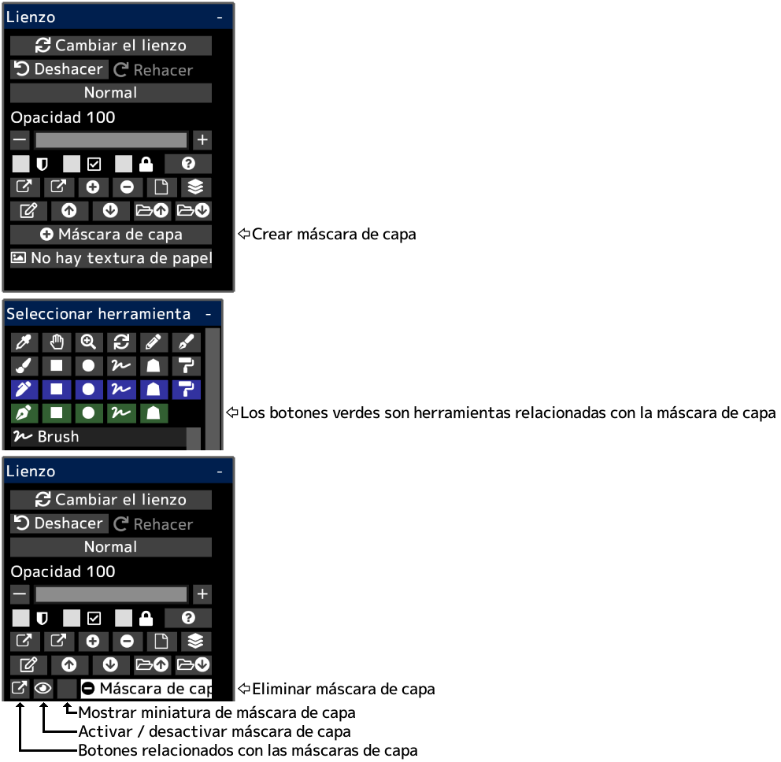

---
hide:
  - toc
---

<!-- https://steamcommunity.com/sharedfiles/filedetails/?id=2953905167 -->

Puede ocultar parcialmente el contenido del dibujo utilizando una máscara de capa.  
Una máscara de capa tiene una opacidad (0 ~ 255).  
También puede crear una máscara de capa para el grupo.  
Si crea una máscara de capa para la capa de ajuste, puede ajustar la parte para que se vea afectada por la capa de ajuste.
