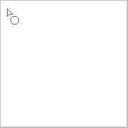

---
hide:
  - toc
---

<!-- https://steamcommunity.com/sharedfiles/filedetails/?id=2967684921 -->

Puede seleccionar la herramienta "Rectángulo" haciendo clic en el botón ■ en la ventana "Seleccionar herramienta".

Ejemplo de pintura con RGBA (44,134,245,150)

Ejemplo de pintura con __"Esquinas redondeadas"__ marcada y configurada al 60 %

Ejemplo de pintura con la casilla de verificación __"Marco"__ activada

Si marca la casilla de verificación __"Relación de aspecto"__, puede fijar la proporción de la altura y el ancho del rectángulo.  
Si marca la casilla de verificación __"px"__, puede especificar la altura y el ancho del rectángulo en unidades de px.

### Herramienta "Circulo"

Ejemplo de pintura con RGBA (44,134,245,150)

Ejemplo de pintura con el botón de radio "Mas blando" seleccionado

Ejemplo de pintura con __"Elipse"__ marcada y configurada en 40

Ejemplo de pintura con el botón de radio "Mas blando" seleccionado

### Herramienta "Lazo"

Ejemplo de pintura sin difuminar (RGBA (44,134,245,255))

Ejemplo de pintura con difuminar 15x15 px (RGBA (44,134,245,150))

Ejemplo de pintura con la casilla de verificación __"Modo de visualización"__ activada (difuminar 3x3 px)

### Herramienta "Polígono"

Con la herramienta "Polígono", la posición en la que se hace clic se convierte en el vértice del polígono.  
Puede deshacer hasta uno.

---

Todos estos métodos de pintura también se pueden pintar en __"Modo de fusión"__.  
Por ejemplo, puede oscurecerlo pintando con el modo de fusión "Multiplicar".  
Además, por ejemplo, puede hacerlo más brillante pintándolo con un amarillo blanquecino en el modo de fusión "Añadir(Brillar)".
