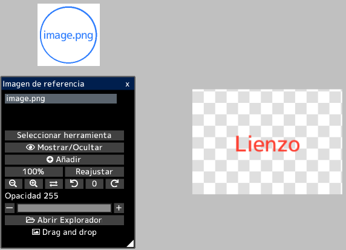
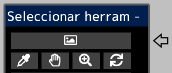

---
hide:
  - toc
---

<!-- https://steamcommunity.com/sharedfiles/filedetails/?id=2966627689 -->

Al abrir la imagen en la ventana "Imagen de referencia", puede mostrar la imagen por separado del lienzo.  
Puede usarlo como referencia al crear ilustraciones.

Puede mover libremente la imagen de referencia haciendo clic en el botón __"Seleccionar herramienta"__.  
También puede seleccionar herramientas para imágenes de referencia en la ventana "Seleccionar herramienta".

