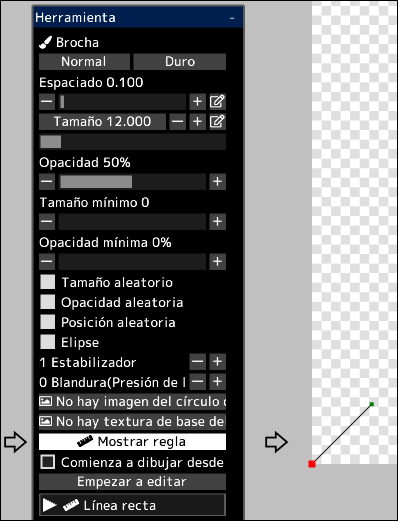
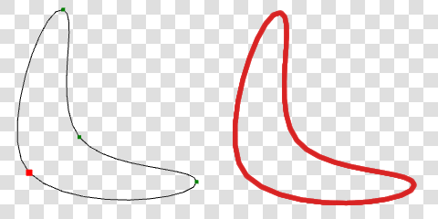

---
hide:
  - toc
---

<!-- https://steamcommunity.com/sharedfiles/filedetails/?id=2969760543 -->

Puede dibujar pinceladas a lo largo de la regla.

Al hacer clic en el botón __"Mostrar regla"__, la regla se mostrará en la posición inferior izquierda del lienzo.  
Esta regla tiene la misma característica que las curvas en capas vectoriales.  
El punto rojo en la regla es el punto de partida de la regla.

Cuando la opción __"Comienza a dibujar desde el punto de inicio de la regla(punto rojo)"__ no está marcada, el trazo del pincel será desde el punto de la distancia más corta entre la posición tocada con el pincel y la regla.

Al hacer clic en el botón __"Empezar a editar"__, podrá cambiar la forma de la regla.

|  | Cómo utilizar |
| ------ | ----------- |
| Seleccionar el punto de control | Haga clic en el punto de control |
| Mover el punto de control       | Haga clic y arrastre el punto de control |
| Eliminar el punto de control    | Alt + clic en el punto de control |
| Si el punto de control debe ser nítido o una curva suave | Ctrl + clic en el punto de control |
| Agregar un punto de control al final de la curva | Haga clic en cualquier lugar que no sea el punto de control |
| Agregar un punto de control en el medio de la curva | Haga clic en cualquier parte de la curva |
| Agregar un punto de control (ángulo agudo) al final de la curva | Ctrl + clic en cualquier lugar que no sea el punto de control |
| Agregar un punto de control (ángulo agudo) en el medio de la curva | Ctrl + clic en cualquier parte de la curva |
| Mover la curva manteniendo la forma de la curva | Shift + Alt + clic y arrastrar |
| Mover múltiples puntos de control juntos | Shift + clic y arrastre para mover todos los puntos de control dentro del círculo |
| Escalar la curva | Ctrl + Alt + clic y arrastrar hacia la izquierda o hacia la derecha |
| Girar la curva alrededor de la posición en la que se hizo clic | Ctrl + Shift + Alt + clic y arrastrar hacia la izquierda o hacia la derecha |

Al hacer clic en el botón __"Terminar de editar"__, podrá volver a dibujar con el pincel.
