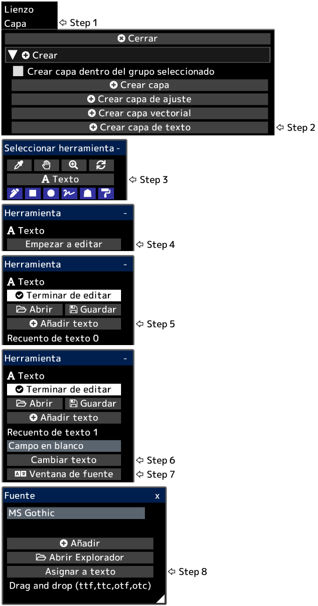

---
hide:
  - toc
---

<!-- https://steamcommunity.com/sharedfiles/filedetails/?id=2954854717 -->

El texto se crea en la posición inferior izquierda del lienzo.  
Después de hacer clic en __"Terminar de editar"__, se aplicarán la opacidad de la capa, el modo de fusión, la máscara de capa, etc.

Puede convertir una capa de texto en una capa de dibujo haciendo clic en el botón __"Rasterizar capa"__ en el menú "Capa".