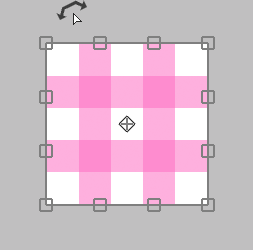

---
hide:
  - toc
---

<!-- https://steamcommunity.com/sharedfiles/filedetails/?id=2955716337 -->

### Si el cursor está dentro del área de transformación

Puedes moverlo libremente haciendo clic.

Puede moverlo solo horizontalmente o solo verticalmente con Shift + clic.

### Si el cursor está fuera del área de transformación

Puede rotarlo haciendo clic.

Puede girarlo alrededor del ancla haciendo Ctrl + clic.

### Si el cursor está en el ancla

Puede mover solo el ancla haciendo clic.

### Si el cursor está en el borde ( □ ) superior, inferior, izquierdo o derecho

Puede mover el borde haciendo clic.

Puede mover ambos lados al mismo tiempo sin mover la posición central con Alt + clic.

Puede mover el borde libremente presionando Ctrl + clic.

Puede mover el borde a lo largo de su dirección con Ctrl + Shift + clic.

### Si el cursor está en 4 vértices ( □ )

Puede mover el vértice haciendo clic.

Puede escalarlo y rotarlo con Alt + clic.

Puede escalarlo uniformemente presionando Shift + clic.

Puede escalarlo uniformemente sin mover la posición central con Shift + Alt + clic.

---

Puede mover solo el vértice libremente con Ctrl + clic.  
En este caso, la apariencia cambia de tres maneras.

#### Ctrl + clic en "Transformar"

#### Ctrl + clic en "Transformación de perspectiva" con "Perspectiva" desactivada

#### Ctrl + clic en "Transformación de perspectiva" con "Perspectiva" activada

Puede volver al estado anterior a la transformación presionando el botón __"Reajustar"__.

* Transformar(tamaño del lienzo)
* Mover Escala Rotar(tamaño del lienzo)
* Transformación de perspectiva
* Filtro licuar
* Filtro retocar

Estos cinco métodos pueden guardar los contenidos de transformación.  
Si se guarda, puede aplicar la misma transformación a otra capa.

Si desea transformar especificando un valor numérico, utilice __"Mover Escala Rotar"__.  
Por ejemplo, si desea reducir la escala al 50 % o girarla 45 grados.
