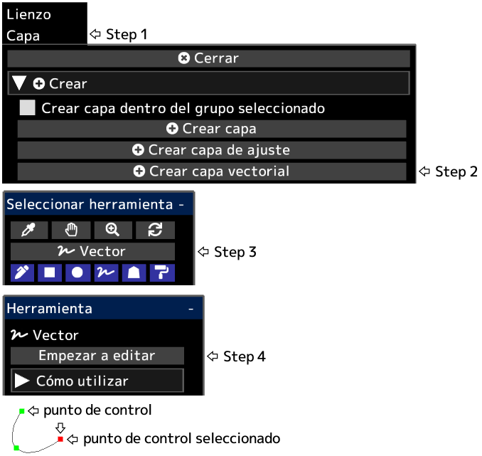

---
hide:
  - toc
---

<!-- https://steamcommunity.com/sharedfiles/filedetails/?id=2955214499 -->

Después de hacer clic en __"Terminar de editar"__, se aplicarán la opacidad de la capa, el modo de fusión, la máscara de capa, etc.

Puede convertir una capa vectorial en una capa de dibujo haciendo clic en el botón __"Rasterizar capa"__ en el menú "Capa".

|  | Cómo utilizar |
| ------ | ----------- |
| Seleccionar el punto de control | Haga clic en el punto de control |
| Deseleccionar el punto de control | Alt + clic en cualquier lugar que no sea el punto de control |
| Mover el punto de control | Haga clic y arrastre el punto de control |
| Eliminar el punto de control | Alt + clic en el punto de control |
| Si el punto de control debe ser nítido o una curva suave | Ctrl + clic en el punto de control |
| Agregar un punto de control al final de la curva | Haga clic en cualquier lugar que no sea el punto de control con el punto de control seleccionado |
| Agregar un punto de control en el medio de la curva | Haga clic en cualquier parte de la curva con el punto de control seleccionado |
| Agregar un punto de control (ángulo agudo) al final de la curva | Ctrl + clic en cualquier lugar que no sea el punto de control con el punto de control seleccionado |
| Agregar un punto de control (ángulo agudo) en el medio de la curva | Ctrl + clic en cualquier parte de la curva con el punto de control seleccionado |
| Crear un punto de control como otra curva | Haga clic en cualquier lugar que no sea el punto de control sin ningún punto de control seleccionado |
| Crear un punto de control (ángulo agudo) como otra curva | Ctrl + clic en cualquier lugar que no sea el punto de control sin ningún punto de control seleccionado |
| Eliminar la curva | Repita Alt + clic en todos los puntos de control, o haga clic en el botón "Eliminar curva" |
| Mover la curva manteniendo la forma de la curva | Shift + Alt + clic y arrastrar con el punto de control seleccionado |
| Duplicar la curva | Ctrl + Shift + clic y arrastrar con el punto de control seleccionado |
| Mover múltiples puntos de control juntos | Shift + clic y arrastre para mover todos los puntos de control dentro del círculo |
| Escalar la curva | Ctrl + Alt + clic y arrastrar hacia la izquierda o hacia la derecha |
| Girar la curva alrededor de la posición en la que se hizo clic | Ctrl + Shift + Alt + clic y arrastrar hacia la izquierda o hacia la derecha |
